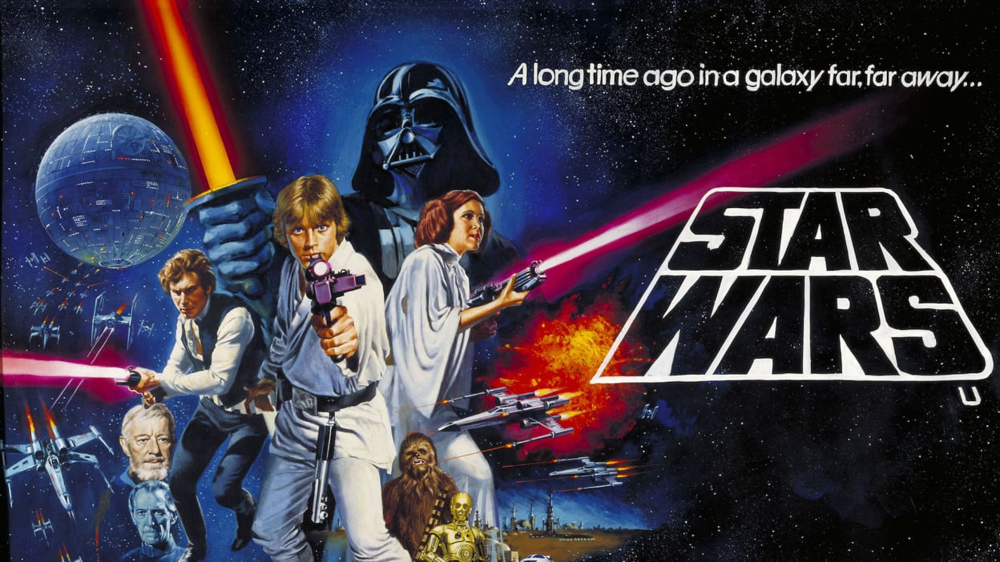

In the enthralling world of cinema 🎥, actors play a pivotal role, shaping and being shaped by the ever-evolving tapestry of human history. Embark with us on a cinematic journey through time as we explore actor’s recognition and their evolving representation in the world of cinema across history. Has an actor's recognition and its longevity been influenced by specific attributes such as genre, ethnicity? Acting isn't an isolated art form but rather intricately connected to the tapestry of human existence, always influenced and shaped by historical events. Our objective is to decode the impact of pivotal historical events, such as the Civil Rights and Feminist Movements, on the composition of actors in terms of gender and ethnicity. This project invites you on a cinematic journey delving into the life of actors who have graced the Cinema screens, examining how they have been portrayed, known and represented over time.

EXPLAIN MORE IN DETAIL THE PLAN OF WHAT WE ARE DOING

PUT ALL USED DATASETS

A LOT OF MISSING DATA FOR EARLY YEARS THIS CAN AFFECT THE ANALYSIS

# Actor’s Recognition

We've all certainly always got into debates like: "No! This actor is more worldwide recognized than this one!" or things like: "I don't agree, I think this actor is the most known ever!" We've come to help! To mitigate any doubt, the idea would be to quantify an Actor's Recognition and study its evolution. Let's start walking you through how we do that. In our analysis, we consider that an Actor's recognition depends on the revenue, quality and popularity of the movies the corresponding Actor acts in. Indeed, if an Actor is very well-known, he would be majoritarly acting in movies of high revenue and high popularity. On the other hand, a not-so recognized Actor would be in the major part of his career in movies that are not very well-known, i.e. that do not have very high revenues and that are not very popular. To account for movie revenue we use the movie Box-office while adapting its value with yearly inflation rates to have the same monetary scale for comparison. Furthermore to account for quality and popularity, we use IMDb ratings, IMDb rating would not only qantify the cinematic quality of a movie but also its popularity, since IMDb rating are done by "normal movie lovers" (CHANGE) and not by professional critics. To have the Box-office and ratings on a comparable scale, we normalize them and scale them on a scale going from 0 to 1. What is necessary now is that we define a recognition coefficient ($$RC$$)  to asses the recognition of an actor. Let us now define some coefficients that will be relevant to our analysis.

In our methodology for assessing an actor's recognition over time, we introduce the concept of a movie recognition coefficient ($$RC_{movie}$$). This coefficient captures an actor's recognition in a specific year and movie, calculated as the average of the normalized movie rating and box office revenue scores:

$$RC_{movie}(actor,year,movie) = \frac{Normalized \_ Revenue(actor,year,movie) + Normalized \_ Rating(actor,year,movie)}{2}$$

Here, $$Normalized \_ Revenue(actor, year, movie)$$ and $$Normalized \_ Rating(actor, year, movie)$$ represent the normalized rating and box office revenue scores, respectively.

To gauge an actor's overall recognition in a given year, we aggregate the movie recognition coefficients using the formula:

$$RC_{year}(actor,year) = \frac{1}{n(actor)} \sum_{i=1}^{n(actor)} RC_{movie}(actor,year,{movie}_i)$$

In this equation, $$n(actor)$$ represents the total number of movies in which the actor participated during the specific year.

Recognizing that an actor may maintain a certain level of recognition even in years with no movie releases, we incorporate a momentum effect. The yearly recognition coefficient is updated with a fraction ($$C=0.9$$) of the actor's previous year's recognition coefficient:

$$\overline{RC_{year}}(actor,year) = RC_{year}(actor,year) + C *\overline{RC_{year}}(actor,year-1)$$

It is important to note that we initialize the momentum term, $$\overline{RC_{year}}(actor, 0)$$, to zero.

Finally, to obtain an actor's overall recognition coefficient, we aggregate the yearly recognition coefficients with momentum over a span of years:

$$RC_{overall}(actor) = \frac{1}{Y} \sum_{i=1}^{Y} \overline{RC_{year}}(actor,{year}_i)$$

Here, $$Y$$ represents the total number of years considered in the analysis. This comprehensive approach provides a nuanced understanding of an actor's recognition, accounting for both individual movie performances and the temporal evolution of their career.

After defining these coefficients, we can now delve into our analysis of Actors' Recognition. First, since we have a yearly $$RC$$ for every actor, it would be interesting to examine the mean-magnitude of recognition every year, here's a plot showing this.



RESULTS:
Doing a Pearson test on this aggregated data, we find a $$p-value=10^{-31} < < 0.05$$. This means that we have strong evidence to reject the null-Hypothesis that suggests that there is no correlation between the Year and the Average Recognition Coefficient. This would suggest that with time the average "Magnitude of Recognition" of actors increases, i.e. the revenue and rating of movies increases with time, suggesting that actors become more and more well-recognized and Cinema is taking a bigger part in society. That is indeed what we see in the plot, where we see that thr average recognition coefficient is increasing with time.

Looking at the graph, we suspect that there is a strong change in the way the average recognition coefficient increases post-1970. 

To be sure of that, we can perform a Chow test, which tests if the coefficients in two different regression models on different regions of the data are equal. Performing the test, we get a $$p-value=  < < 0.05$$ **WRITE THE VALUE HERE**

Since the p-value is less than .05, we can reject the null hypothesis of the test. This means we have sufficient evidence to say that a structural break point is present in the data.
**CHOW TEST: STATISTICAL TEST TWO SEE IF TWO PARTS OF A TIMESERIES VARIABLE HAVE DIFFERENT TRENDS?**

**Actors are getting even more recognized and the Cinema is booming after 1970, this is due to ...**

**SEARCH FOR REASONS (IMPORTANT DATES IN CINEMA? THE GODFATHER 1972?)**
**Blockbuster Phenomenon "Jaws" (1975): Directed by Steven Spielberg, "Jaws" is often considered the first blockbuster film, changing the landscape of film distribution and marketing.
"Star Wars" (1977):George Lucas's "Star Wars" revolutionized the science fiction genre and became a cultural phenomenon, setting new standards for special effects and merchandising.
Home Video Revolution (1980) :**
**The introduction of VHS and Betamax allowed audiences to watch films at home, transforming the industry's distribution model.**

  
  

  

In the meantime we see also some decrease, this likely due to the fact that in the most recent years (until 2012), the data is not very much up to date.

After checking the Actor Recognition through the years, let us move on to the more exciting part: Evaluating the overall recognition of actors. We present here a list of Actors ranked by most recognized to less recognized. You can try to find your favorite actor and see how is he ranked. Also, as a small game, considering all the actors you know, try to find the less known of them in this list!

ADAPT ETHNICITIES (AND NOT KNOWN  ONES)



We hope that you found your favorite actors among this list 😀.
 
The above table provides a glimpse into the top well-recognized actors, showcasing their General Recognition Coefficients. Notably, in the first rankings the list features both contemporary figures like Robert De Niro and iconic actors from earlier periods, such as John Wayne and Sean Connery. Also, sadly but intuitivly, we see that the number of female actors is very minorr. Showcasing the still existing dominace of well-known male actors.
This ranking highlights the timeless influence of actors, encompassing both modern-day stars and those from cinematic history.

Moving on, having this list of actors, we can try to visualize the distribution of only the top 10% Well-recognized of these actors. Are the modern-day actors more present among these 10%?



Indeed as we can imagine, we see that among these 10% of actors, their majority is present in modern-days. Once again, we see this final decrease we saw before, likely due to the fact that in the most recent years (until 2012), the data is not very much up to date. Moreover, we can also see this sudden increase in number of actors post-1970, which is likely to be due to the reasons we explained before.

# Actor Recognition Longevity

Now that we had a timely approach to Actors' Recognition, let's now see how this Recognition lasts over time. The idea is to examine the span of the actors' Recognition through time. In other words, we are trying to find the year in which the actor started to be well-recognized and the year this recognition "ended". The criteria for determining these periods involve selecting the range of years in which the Actor Yearly Recognition Coefficient surpasses a defined threshold. This threshold is set at 50% of the actor's highest recognition coefficient score, providing a concise measure of the actor's sustained impact over time. We can see below the plot showing the average span of recognition through the years.



We observe that actors starting to be well-recognized after 1970 have decreasingly small spans of recognition. This is due to the fact the data we have ends in 2012, this means that these actors are probably still acting after 2012 but we don't have the corresponding data. Therefore the Last Year of recognition of these actors is considered to be around 2012 as we can see in the following histogram



In order to evaluate the correlation between the average recognition span and first year of recognition, we use only the data before 1970, since the decrease of recognition span after 1970 is not reflective of the reality. Therefore, we fit a linear regression on spans starting before 1970.



Based on the above graph and the Pearson test we do (which gives us a $$p-value= 0.0008<0.05$$ ), we observe a trend of increase in the average span of recognition for actors (before 1970). This result suggests that with time actors tend to have longer periods of recognition. This could be attributed to several factors like increase in quality of health and more late retirements.

## Recognition coefficient of specific actors
As an interesting step, we can also inspect the evolution of the recognition coefficient of different actors:



From the graphs above, we can see how the Recognition of different actors varies with time:
- Michael Caine: We can see that Michael Caine has a very long span of recognition, starting to be well-recognized around 1960 until after 2012. It is also interesting to notice that for the period 1990-2000, he acted in less-succesful movies, but then he had his recognition increase again.
- John Wayne: The second plot with John Wayne is also very interesting since it allows to visualize the Recognition of an actor that stopped to be well-recognized. We can see how his recognition coefficient decreases with time abruptly after 1979, which is in fact the date of his death

Now, your turn! You can see the plot of the evolution of the recognition of your favorite actor. Try **INTERESTING EXAMPLES**


# Remarks

Limitation: we know that other more subtle factors could be taken into account to improve the accuracy of the analysis, like social media influence of the actor, and (CITE OTHER FACTORS).

PUT INTERACTIVE PLOTS

PUT INTERACTIVE LIST WITH RANKED ACTORS (WHERE YOU CAN SCROLL AND FIND A SPECIFIC ACTOR NAME)
https://www.convertcsv.com/csv-to-html.htm

